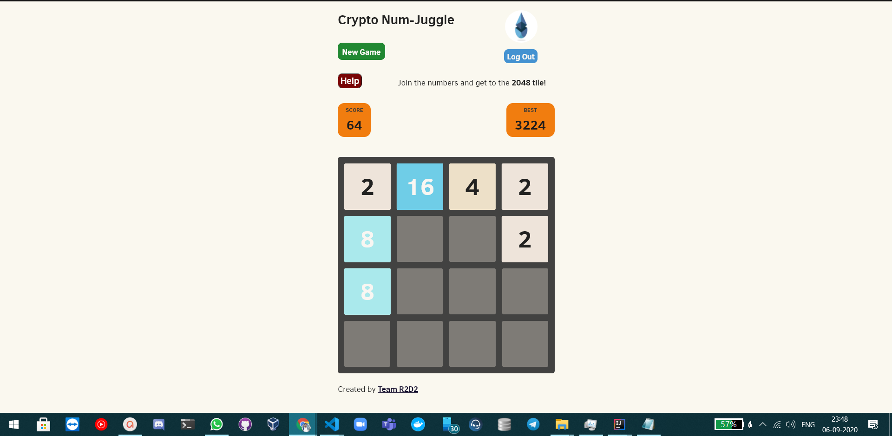

# Crypto Num Juggle 

 

 

## For Dapp Jedi Hackathon by Team R2-D2. 
 

## Submission URL: https://github.com/KedarKshatriya/CNJDjango
 

## You can check our project live at: https://cryptonj.herokuapp.com/
 

## Presentation Link: https://www.youtube.com/watch?v=FnF3U1fO2Gs&feature=emb_title

 

## The problem Crypto Num-Juggle solves
* It provides an average user easy onboarding with the blockchain-based game using portis wallet. 
* Interaction with blockchain is much faster because of Matic's Plasma framework.
* The auto rewarding system checks the user's best score is stored on the Matic blockchain using their wallet addresses. 
* The game depends on the Player's  Best score, the more the player scores the more Matic tokens he would be rewarded.

## Challenges we ran into
* The integration with the portis wallet was a tricky task.
* Saving the game state and best scores in realtime, while keeping in mind to not reduce the game performance was really tough.

 But we were able to successfully overcome all these challenges.

## Technology Stack 
1. Django
2. JavaScript
3. Heroku
4. ethers.js
5. matic network
6. Python3 
7. HTML/CSS
8. Portis